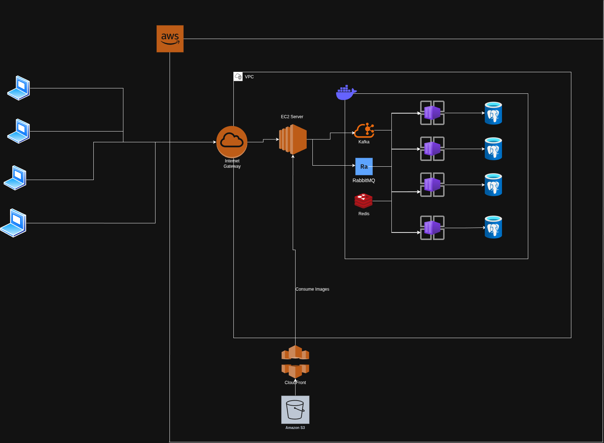
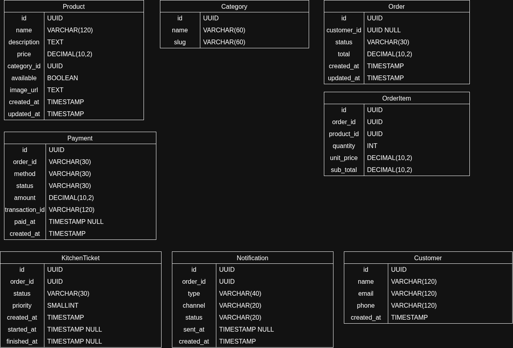
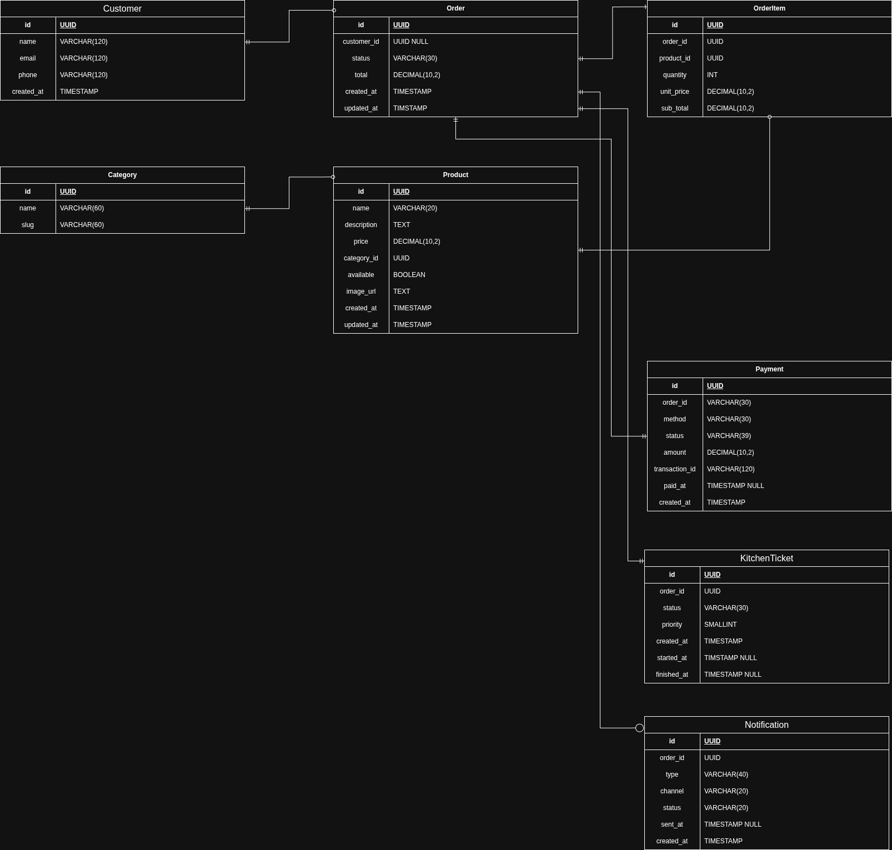
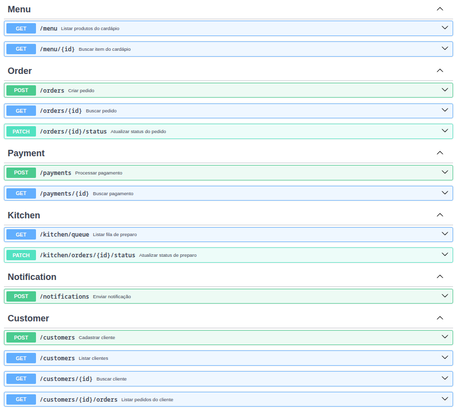

# Backend Catccino ☕🐈

Backend de uma cafeteria temática inspirada em gatos.

O objetivo principal do projeto é estudar uma arquitetura de backend usando **microsserviços**, **mensageria com Kafka** e **Clean Architecture**.

O sistema simula o funcionamento de uma cafeteria:
- O cliente se registra e faz login;
- Consulta o cardápio;
- Faz um pedido;
- Esse pedido vai automaticamente para a cozinha;
- O pagamento é processado;
- E o cliente recebe notificações durante todo o processo.

Toda a comunicação entre serviços acontece de duas formas: **síncrona** (HTTP, quando um serviço precisa de uma resposta imediata de outro) e **assíncrona** (eventos via Kafka, quando um serviço apenas reage a algo que aconteceu em outro).

---

## 🌎 Scripts para execução | Run scripts

Antes de executar os containers, leia atentamente a documentação dos scripts disponíveis.
Alguns scripts podem remover containers, imagens e volumes Docker existentes.

Before running the containers, carefully read the available scripts documentation.
Some scripts may remove existing Docker containers, images, and volumes.

📚 Scripts documentation:

[Scripts Documentation](https://github.com/thuhsf/catccino-web-project/tree/main/scripts/docker)

---

### 📋 Pré-requisitos | Prerequisites

- [Docker](https://docs.docker.com/get-docker/) e Docker Compose
- [Git](https://git-scm.com/)

---

### 🔑 Variáveis de ambiente | Environment variables

Cada serviço possui um arquivo `.env.example` que deve ser copiado para `.env` antes de subir o projeto:

```sh
for s in menu order payment kitchen notification customer auth; do
  cp services/$s/.env.example services/$s/.env
done
```

> No `services/menu/.env`, os campos de AWS (`AWS_BUCKET_NAME`, `AWS_REGION`, `AWS_ACCESS_KEY_ID`, `AWS_SECRET_ACCESS_KEY`, `CDN_URL`) são opcionais — usados apenas para upload de imagens de produtos no S3. Sem eles, o restante do sistema funciona normalmente.
>
> In `services/menu/.env`, the AWS fields are optional — used only for product image upload to S3. Without them, the rest of the system works normally.

---

### 🚀 Inicialização limpa | Clean startup

Recria os serviços do zero.

Recreates the services from scratch.

```sh
chmod +x ./scripts/docker/start-clean.sh
```

```sh
./scripts/docker/start-clean.sh
```

> ⚠️ Pode remover containers, imagens e volumes antigos.
> ⚠️ May remove old containers, images, and volumes.

---

### 🐳 Inicialização padrão | Standard startup

Executa o ambiente utilizando apenas Docker Compose.

Runs the environment using plain Docker Compose.

```sh
docker compose up --build -d
```

---

### 🛑 Parar containers | Stop containers

```sh
docker compose down
```

---

### 🧹 Remover containers + volumes | Remove containers + volumes

```sh
docker compose down -v
```

> ⚠️ Remove também os dados persistidos nos volumes Docker.
> ⚠️ Also removes persisted Docker volume data.

---

### 🔗 Acessando o projeto | Accessing the project

Depois que todos os containers estiverem `Up` (`docker compose ps`), acesse:

| Serviço | URL |
|---|---|
| API Gateway (Nginx) | `http://localhost/api/v1/...` |
| Swagger (documentação/teste da API) | `http://localhost:8081` |
| Kafka UI (visualizar tópicos e mensagens) | `http://localhost:8080` |

---

## 🌎 Languages

- [Português](#pt-br)
- [English](#en)

---

# <a id="pt-br"></a>🇧🇷 Português

## Sobre o projeto

O **Catccino** é uma cafeteria temática inspirada no universo felino.
O sistema centraliza as principais operações da cafeteria:

- cadastro e login de clientes (com autenticação JWT);
- visualização do cardápio;
- criação de pedidos;
- envio automático dos pedidos para a cozinha;
- processamento de pagamentos;
- atualização e notificação do status dos pedidos em tempo real.

O projeto foi desenvolvido com foco em aprendizado de arquitetura backend, microsserviços, mensageria orientada a eventos e organização de aplicações escaláveis.

---

## Arquitetura

O sistema é dividido em **7 microsserviços independentes**, cada um com seu próprio banco de dados PostgreSQL, seguindo princípios de Clean Architecture (entities, repositories, use-cases, controllers e gateways de comunicação entre serviços).

| Serviço | Porta | Responsabilidade |
|---|---|---|
| Menu Service | 4000 | Cardápio: categorias e produtos (com upload de imagens opcional via S3) |
| Order Service | 4001 | Criação e gestão de pedidos |
| Payment Service | 4002 | Processamento de pagamentos |
| Kitchen Service | 4003 | Fila/tickets de preparo na cozinha |
| Notification Service | 4004 | Notificações ao cliente |
| Auth Service | 4005 | Autenticação e emissão de tokens JWT |
| Customer Service | 4006 | Cadastro e dados de clientes |

Toda a comunicação externa passa por um **API Gateway (Nginx)**, que roteia as requisições para o serviço correto sem expor a topologia interna.

A comunicação entre os serviços acontece de duas formas:
- **Síncrona (HTTP):** quando um serviço precisa de uma resposta imediata de outro — por exemplo, o `order` valida produto e preço consultando o `menu` antes de criar o pedido.
- **Assíncrona (Kafka):** quando um serviço apenas reage a um evento que já aconteceu — por exemplo, ao criar um pedido, o `order` publica o evento `order.created`, que é consumido automaticamente pelo `kitchen` (para gerar o ticket de preparo) e pelo `notification` (para avisar o cliente), sem que esses serviços se conheçam entre si.

O cluster Kafka roda com dois brokers (`kafka1` e `kafka2`) coordenados por um Zookeeper, simulando um ambiente distribuído real.

---

## Status do projeto

### Fase 1 (MVP)

- [x] Menu Service
- [x] Order Service
- [x] Kitchen Service
- [x] Payment Service
- [x] Notification Service

### Fase 2

- [x] Customer Service
- [ ] Inventory Service
- [ ] Staff Service

### Fase 3

- [ ] Loyalty Service
- [ ] Promotion Service
- [ ] Reporting Service
- [ ] Delivery Service

### Fase 4

- [x] Auth Service
- [x] API Gateway
- [x] Event Bus (Kafka)
- [ ] Observability (logs centralizados, monitoramento, rate limiting)

---

## Tecnologias utilizadas

- **Node.js + TypeScript** — tipagem estática para reduzir bugs em um sistema distribuído
- **PostgreSQL** — um banco de dados por serviço, reforçando o isolamento real de microsserviços
- **Apache Kafka + Zookeeper** — mensageria para comunicação assíncrona e orientada a eventos entre serviços, rodando com 2 brokers
- **Kafka UI** — interface visual para inspecionar tópicos e mensagens do Kafka
- **Docker + Docker Compose** — cada serviço containerizado, com healthchecks garantindo a ordem correta de inicialização
- **Nginx** — API Gateway único, escondendo a topologia interna e resolvendo CORS centralizadamente
- **JWT** — autenticação e autorização no Auth Service
- **Swagger/OpenAPI** — documentação e teste interativo da API
- **AWS S3** *(opcional)* — armazenamento de imagens de produtos no Menu Service

---

## Segurança e observabilidade

Já implementado:

- [x] autenticação com JWT;
- [x] validação de dados (Zod);

Planejado:

- [ ] logs centralizados;
- [ ] monitoramento dos serviços;
- [ ] rate limiting;
- [ ] rastreamento de requisições.

---

## Diagramas

### Arquitetura de serviços



### Modelos iniciais



### Relação entre modelos



---

## APIs

Documentação interativa disponível via Swagger:



---

## Objetivo do projeto

Além da proposta da cafeteria fictícia, o projeto também serve como estudo de:

- arquitetura backend e microsserviços;
- mensageria orientada a eventos (Kafka);
- Clean Architecture e organização de código;
- APIs REST e documentação com Swagger;
- autenticação e autorização com JWT;
- Docker e orquestração de containers;
- comunicação síncrona e assíncrona entre serviços.

---

## Desenvolvido por

Thuanny Helen

---

# <a id="en"></a>🇺🇸 English

## About the project

**Catccino** is a cat-themed coffee shop backend project.

The system centralizes the coffee shop's core operations:

- customer registration and login (JWT authentication);
- menu visualization;
- order creation;
- automatic order routing to the kitchen;
- payment processing;
- real-time order status updates and notifications.

The project was built with a strong focus on learning backend architecture, microservices, event-driven messaging, and scalable application design.

---

## Architecture

The system is split into **7 independent microservices**, each with its own PostgreSQL database, following Clean Architecture principles (entities, repositories, use-cases, controllers, and gateways for inter-service communication).

| Service | Port | Responsibility |
|---|---|---|
| Menu Service | 4000 | Menu: categories and products (optional S3 image upload) |
| Order Service | 4001 | Order creation and management |
| Payment Service | 4002 | Payment processing |
| Kitchen Service | 4003 | Kitchen preparation queue/tickets |
| Notification Service | 4004 | Customer notifications |
| Auth Service | 4005 | Authentication and JWT token issuing |
| Customer Service | 4006 | Customer registration and data |

All external communication goes through an **API Gateway (Nginx)**, which routes requests to the right service without exposing the internal topology.

Inter-service communication happens in two ways:
- **Synchronous (HTTP):** when a service needs an immediate response from another — e.g. `order` validates product and price with `menu` before creating an order.
- **Asynchronous (Kafka):** when a service just reacts to something that already happened — e.g. `order` publishes an `order.created` event, automatically consumed by `kitchen` (to generate a preparation ticket) and `notification` (to notify the customer), without those services knowing about each other.

The Kafka cluster runs with two brokers (`kafka1` and `kafka2`) coordinated by Zookeeper, simulating a real distributed environment.

---

## Project status

### Phase 1 (MVP)

- [x] Menu Service
- [x] Order Service
- [x] Kitchen Service
- [x] Payment Service
- [x] Notification Service

### Phase 2

- [x] Customer Service
- [ ] Inventory Service
- [ ] Staff Service

### Phase 3

- [ ] Loyalty Service
- [ ] Promotion Service
- [ ] Reporting Service
- [ ] Delivery Service

### Phase 4

- [x] Auth Service
- [x] API Gateway
- [x] Event Bus (Kafka)
- [ ] Observability (centralized logs, monitoring, rate limiting)

---

## Technologies

- **Node.js + TypeScript** — static typing to reduce bugs in a distributed system
- **PostgreSQL** — one database per service, reinforcing true microservice isolation
- **Apache Kafka + Zookeeper** — asynchronous, event-driven messaging between services, running with 2 brokers
- **Kafka UI** — visual interface to inspect topics and messages
- **Docker + Docker Compose** — each service containerized, with healthchecks ensuring correct startup order
- **Nginx** — single API Gateway, hiding internal topology and centralizing CORS
- **JWT** — authentication and authorization in the Auth Service
- **Swagger/OpenAPI** — interactive API documentation and testing
- **AWS S3** *(optional)* — product image storage in the Menu Service

---

## Security and observability

Already implemented:

- [x] JWT authentication;
- [x] data validation (Zod);

Planned:

- [ ] centralized logs;
- [ ] service monitoring;
- [ ] rate limiting;
- [ ] request tracing.

---

## Diagrams

### Services architecture


### Initial models


### Models relationship


---

## APIs

Interactive documentation available via Swagger:


---

## Project goals

Besides the fictional coffee shop proposal, the project is also meant for studying:

- backend architecture and microservices;
- event-driven messaging (Kafka);
- Clean Architecture and code organization;
- REST APIs and Swagger documentation;
- JWT authentication and authorization;
- Docker and container orchestration;
- synchronous and asynchronous service communication.

---

## Developed by

Thuanny Helen
